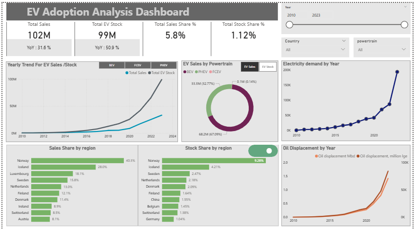
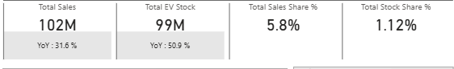
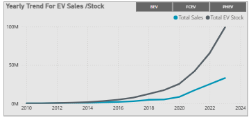

# EV Adoption Analysis

> **Global Electric Vehicle Trends — Dashboard Report Summary**
> Prepared from Power BI Dashboard | November 2025

  

<em>Full Dashboard Overview — EV Adoption Analysis</em>

---

## Table of Contents

1. [Overview](#1-overview)
2. [Key Performance Indicators](#2-key-performance-indicators)
3. [Dashboard Visuals & Analyses](#3-dashboard-visuals--analyses)
4. [Interactive Filters](#4-interactive-filters)
5. [Key Insights This Report Can Deliver](#5-key-insights-this-report-can-deliver)
6. [Conclusion](#6-conclusion)

---

## 1. Overview

This report summarizes the findings of the EV Adoption Analysis Power BI dashboard, which provides a comprehensive view of global Electric Vehicle (EV) adoption trends. The analysis examines both EV sales performance and EV stock (cumulative fleet size) across regions, powertrain types, and time periods.

The dashboard is designed to help stakeholders understand the pace and scale of the EV transition, and to assess its broader energy and environmental implications — specifically the resulting growth in electricity demand and the displacement of oil consumption.

---

## 2. Key Performance Indicators

The dashboard surfaces four headline KPIs at a glance, providing an immediate snapshot of EV market performance:

| KPI Metric | Description |
|---|---|
| **Total EV Sales** | Aggregate units sold across all filters |
| **Total EV Stock** | Cumulative number of EVs in circulation |
| **Sales Share %** | EVs as a proportion of total vehicle sales |
| **Stock Share %** | EVs as a proportion of total vehicle fleet |

  

<em>KPI Cards — Headline metrics at a glance</em>

---

## 3. Dashboard Visuals & Analyses

The report includes eight analytical visuals covering sales, stock, regional performance, powertrain mix, and energy impact:

| Visual Title | Chart Type | Key Insight |
|---|---|---|
| **Yearly Trend for EV Sales / Stock** | Line Chart | Tracks growth trajectory of EV sales and stock over time, spotlighting acceleration points in adoption. |
| **Sales by Region** | Clustered Bar Chart | Compares total EV sales across global regions, highlighting leading and lagging markets. |
| **EV Stock by Region** | Clustered Bar Chart | Shows cumulative EV fleet size per region, reflecting long-term adoption depth. |
| **Sales Share by Region** | Clustered Bar Chart | Contextualizes sales volume as a market penetration percentage per region. |
| **Stock Share by Region** | Clustered Bar Chart | Reflects overall EV fleet penetration relative to total vehicles per region. |
| **EV Stock by Powertrain** | Donut Chart | Breaks down the fleet by powertrain type (BEV vs. PHEV), revealing the technology mix. |
| **Electricity Demand by Year** | Line Chart | Illustrates how growing EV adoption translates into increased electricity consumption. |
| **Oil Displacement by Year** | Line Chart | Quantifies oil demand displaced by EVs in million barrels/day and million lge — a key sustainability metric. |

 

  

<em>Yearly Trend — EV Sales & Stock growth over time</em>

  

<em>Sales & Stock by Region — Comparing global markets</em>

  

<em>Sales Share & Stock Share by Region — Market penetration by geography</em>

  

<em>EV Stock by Powertrain — BEV vs. PHEV breakdown</em>

  

<em>Energy Impact — Electricity Demand growth & Oil Displacement by year</em>

---

## 4. Interactive Filters

The dashboard includes dynamic slicers that allow users to filter all visuals simultaneously, enabling flexible and targeted exploration of the data. Available filters include:

- **Year** — filter analysis to a specific time period or range
- **Region** — isolate performance for a specific geography or group of markets
- **Powertrain Type** — distinguish between Battery Electric Vehicles (BEV) and Plug-in Hybrid Electric Vehicles (PHEV)
- **Sales vs. Stock Metric Toggle** — switch between viewing sales figures and cumulative stock across visuals

  

<em>Interactive Filters — Slicers for Year, Region, Powertrain, and Metric Toggle</em>

---

## 5. Key Insights This Report Can Deliver

By exploring the dashboard, stakeholders can answer critical strategic and operational questions, including:

- **Regional Leaders:** Which regions are leading in EV market penetration versus absolute sales volume? — China accounts for over 60% of global EV sales, while Europe leads in stock share at ~25% fleet penetration in leading markets.

- **BEV vs. PHEV Split:** Is EV growth driven primarily by pure-electric (BEV) or plug-in hybrid (PHEV) vehicles? — Globally, BEVs represent ~70% of new EV registrations, though PHEVs continue to grow rapidly in markets like China and Europe.

- **Electricity Demand Growth:** How is the growth of the EV fleet affecting electricity grid demand over time? — The global EV fleet added an estimated 130 TWh of electricity demand in 2023, a figure projected to exceed 400 TWh by 2030.

- **Oil Displacement:** What is the measurable reduction in oil demand attributable to EV adoption? — EVs displaced approximately 1.5 million barrels of oil per day in 2023, a displacement expected to reach 5–6 million barrels/day by 2030.

- **YoY Growth Trends:** What are the year-over-year trends in EV sales momentum and fleet accumulation? — Global EV sales surpassed 14 million units in 2023, a 35% increase year-over-year, with cumulative stock exceeding 40 million vehicles on the road.

---

## 6. Conclusion

The EV Adoption Analysis dashboard provides a robust, multi-dimensional view of the global electric vehicle market. By tracking key metrics across regions, powertrain categories, and time, it enables data-driven decisions related to market strategy, infrastructure investment, and sustainability planning.

The inclusion of downstream energy metrics — electricity demand growth and oil displacement — makes this report particularly valuable for stakeholders in the energy sector, policymakers, and sustainability teams seeking to understand and quantify the real-world impact of EV adoption.

---

